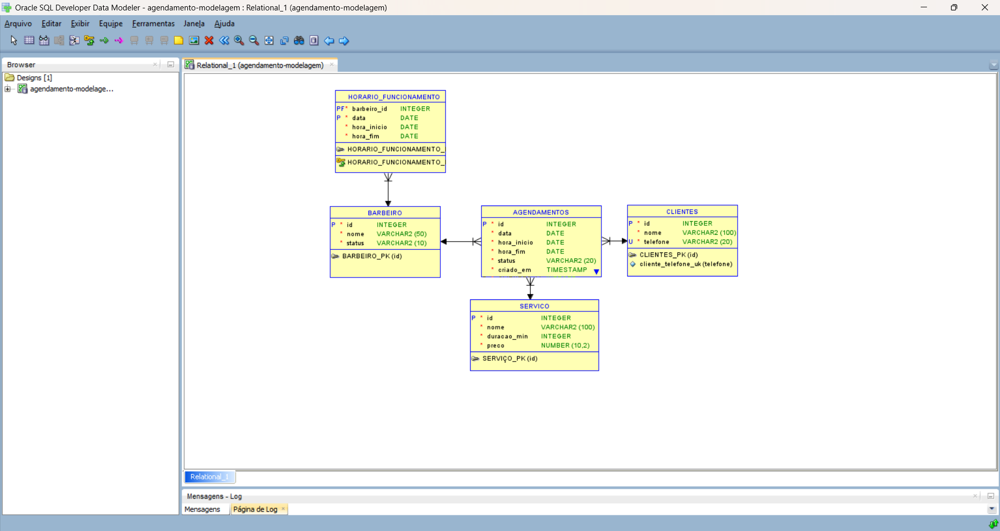
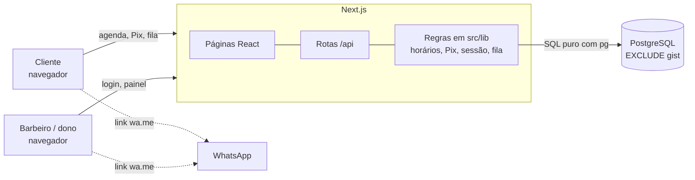
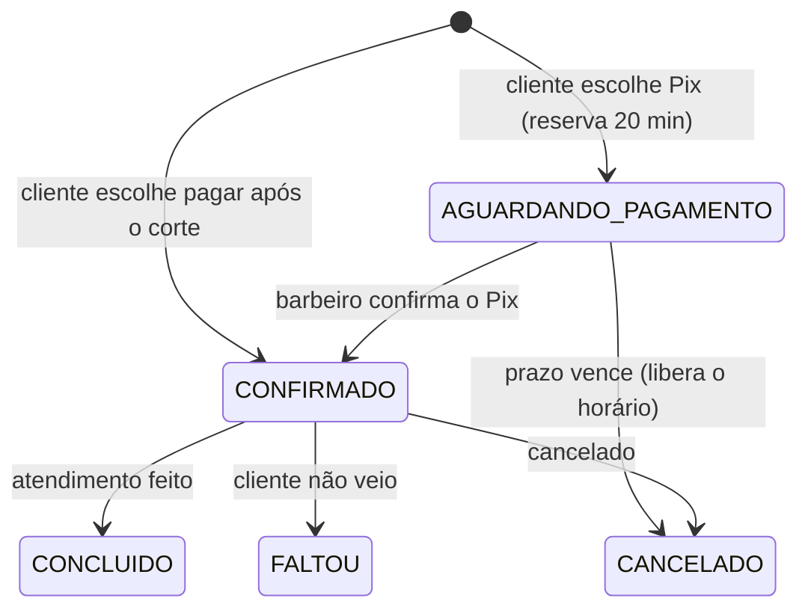

# Barbearia Espiral — agendamento online

[](https://github.com/mateus-henriquee/agendamento-barbearia/actions/workflows/ci.yml)

Sistema de agendamento para barbearia: o cliente escolhe serviço, barbeiro e horário, paga com Pix
(ou depois do corte) e confirma pelo WhatsApp. O barbeiro vê a agenda, confirma pagamentos e
atende a fila de espera. **O banco de dados garante que nenhum horário seja vendido duas vezes.**

<!-- Troque pelo seu GIF: docs/demo.gif -->


## O problema

Barbearias agendam por WhatsApp, à mão. Resultado: horários marcados em duplicidade, esquecimentos
e clientes que não aparecem (no-show), que viram prejuízo.

## O que o sistema faz

**Cliente**
- Escolhe serviço, barbeiro, data e horário. Os horários livres consideram a duração do serviço.
- Paga **agora com Pix** (QR code + copia e cola) ou **depois do corte**.
- Pix reserva o horário por **20 minutos**. Sem pagamento, o horário é liberado sozinho.
- Confirma o agendamento pelo WhatsApp com a mensagem pronta.
- Dia lotado? Entra na **fila de espera**.

**Barbeiro e dono (painel com login)**
- Agenda do dia, com status de cada agendamento e do pagamento.
- Confirma o Pix recebido, marca atendimento concluído ou falta.
- Envia lembrete e aviso de vaga pelo WhatsApp (link `wa.me` com texto pronto).
- Faturamento do mês, serviço mais pedido, resultado por barbeiro (dono).
- Cada barbeiro enxerga só os próprios dados. A regra é aplicada no servidor, não na tela.

## Prova: zero overbooking

20 pessoas tentam o mesmo horário ao mesmo tempo, cada uma por uma conexão diferente, contra um
PostgreSQL real (`npm run prova`; o CI repete com 50):

```
20 pedidos simultâneos para o mesmo horário (79 ms)
  confirmados: 1
  conflitos recusados pelo banco: 19
  linhas gravadas: 1
OK: sem overbooking.
```

Quem garante isso é o banco, não o código da aplicação:

```sql
CONSTRAINT agendamentos_sem_conflito EXCLUDE USING gist (
  barbeiro_id WITH =,
  tsrange(data + hora_inicio, data + hora_fim, '[)') WITH &&
) WHERE (status IN ('AGUARDANDO_PAGAMENTO', 'CONFIRMADO', 'CONCLUIDO'))
```

Duas reservas do mesmo barbeiro com horários que se sobrepõem são impossíveis, mesmo com mil
requisições simultâneas. A aplicação só traduz o erro `23P01` em "horário ocupado" (HTTP 409).

## Arquitetura




## Ciclo de um agendamento com Pix



## Decisões técnicas

- **Concorrência no banco.** Constraint `EXCLUDE USING gist`, não "verificar antes de gravar"
  (que falha em requisições simultâneas).
- **SQL puro, sem ORM.** Migrações em `db/migrations/NNN_*.sql`, aplicadas por `npm run migrar`
  (cada uma em transação, com registro do que já rodou e trava contra deploys simultâneos).
- **Testes com Postgres de verdade.** PGlite (Postgres em WebAssembly) nos testes, Postgres 16 no CI.
- **Sessão segura.** Token aleatório em cookie `httpOnly`; o banco guarda só o hash SHA-256.
  Senhas com bcrypt. Mesma resposta para e-mail errado e senha errada.
- **Bloqueio de força bruta.** 5 erros por e-mail ou 20 por IP em 15 min bloqueiam (HTTP 429),
  inclusive para e-mails que não existem.
- **Pix estático (BR Code).** O código copia e cola é gerado no servidor, com CRC16 validado contra
  o exemplo oficial do Banco Central. Sem chave configurada, a opção Pix não aparece.
- **Preço congelado.** O valor cobrado é gravado no agendamento; mudar o preço do serviço depois não
  altera o histórico nem o faturamento.
- **Fuso horário.** Datas e horas sempre no fuso da barbearia (`America/Sao_Paulo`), nunca no do servidor.
- **Intervalos `[início, fim)`.** Um corte termina às 10:00 e o próximo começa às 10:00 sem conflito.

## Stack

Next.js 16 · React 19 · TypeScript · Tailwind CSS 4 · PostgreSQL · `pg` · Zod · Vitest + PGlite ·
GitHub Actions · Docker (banco local)

## Rodar localmente

Precisa de Node 22+ e Docker.

```bash
git clone https://github.com/mateus-henriquee/agendamento-barbearia.git
cd agendamento-barbearia
npm install

# banco local
docker run -d --name barbearia-db -e POSTGRES_USER=barbearia -e POSTGRES_PASSWORD=senha \
  -e POSTGRES_DB=barbearia -p 5433:5432 postgres:16

cp .env.example .env          # ajuste DATABASE_URL (e o Pix, se quiser)
npm run migrar                # cria as tabelas
docker exec -i barbearia-db psql -U barbearia -d barbearia < db/seed.sql   # dados de exemplo
npm run usuario -- "Dono" dono@exemplo.com senha-forte DONO
npm run dev                   # http://localhost:3000   painel em /login
```

Variáveis (`.env.example`): `DATABASE_URL`, `PIX_CHAVE`, `PIX_NOME`, `PIX_CIDADE`.

## Scripts

| Comando | O que faz |
|---|---|
| `npm run dev` | servidor de desenvolvimento |
| `npm test` | testes (lógica, banco e rotas) |
| `npm run lint` · `npm run typecheck` | qualidade e tipos |
| `npm run migrar` | aplica as migrações que faltam |
| `npm run prova` | prova de concorrência contra o banco do `.env` |
| `npm run usuario -- "Nome" email senha DONO\|BARBEIRO [barbeiroId]` | cria login |

## API

| Método | Rota | Descrição |
|---|---|---|
| GET | `/api/servicos` · `/api/barbeiros` | catálogo |
| GET | `/api/horarios?barbeiroId=&servicoId=&data=` | horários livres |
| POST | `/api/clientes` | cria ou reaproveita cliente pelo telefone |
| POST | `/api/agendamentos` | agenda. `409` se ocupado. Com Pix, devolve o código e o prazo |
| DELETE | `/api/agendamentos/:id` | cancela |
| POST | `/api/fila` | entra na fila de espera (só se o dia estiver cheio) |
| POST | `/api/login` · `/api/logout` | sessão do painel |
| GET | `/api/painel/agenda` · `/api/painel/resumo` · `/api/painel/fila` | painel (login) |
| PATCH | `/api/painel/agendamentos/:id` | concluir ou marcar falta |
| POST | `/api/painel/agendamentos/:id/pago` | confirmar Pix recebido |
| PATCH | `/api/painel/fila/:id` | avisar ou remover da fila |

## Deploy (Vercel + Neon, planos gratuitos)

1. **Banco:** crie um projeto no [Neon](https://neon.tech) e copie a URL de conexão (com `?sslmode=require`).
2. **Migrações:** na sua máquina, `DATABASE_URL="<url do neon>" npx tsx scripts/migrar.ts`.
3. **Dados reais:** cadastre barbeiros, serviços e horários de funcionamento no banco (o `db/seed.sql`
   tem dados fictícios, não use em produção). Crie o primeiro login com `npm run usuario`
   apontando para a URL do Neon.
4. **Site:** importe o repositório na [Vercel](https://vercel.com) e defina as variáveis
   `DATABASE_URL`, `PIX_CHAVE`, `PIX_NOME`, `PIX_CIDADE`.
5. Cada `git push` na `main` roda o CI e publica de novo.

## Limites conhecidos

- **Pix estático:** o sistema não descobre sozinho que o Pix caiu; o barbeiro confirma no painel.
  Pagamento depois do prazo de 20 min não pode ser confirmado (o horário já foi liberado).
  O próximo passo é Pix dinâmico com webhook (Mercado Pago, Asaas ou Efí).
- **WhatsApp por link (`wa.me`):** abre a conversa com o texto pronto, mas quem envia é a pessoa.
  Envio automático exigiria a API oficial do WhatsApp (paga).
- O bloqueio de login por e-mail permite que alguém trave a conta de outra pessoa por 15 minutos
  errando a senha de propósito. É o custo dessa proteção.

## Piloto

> Preencher após testar em uma barbearia real: faltas antes e depois, tempo economizado, depoimento.
